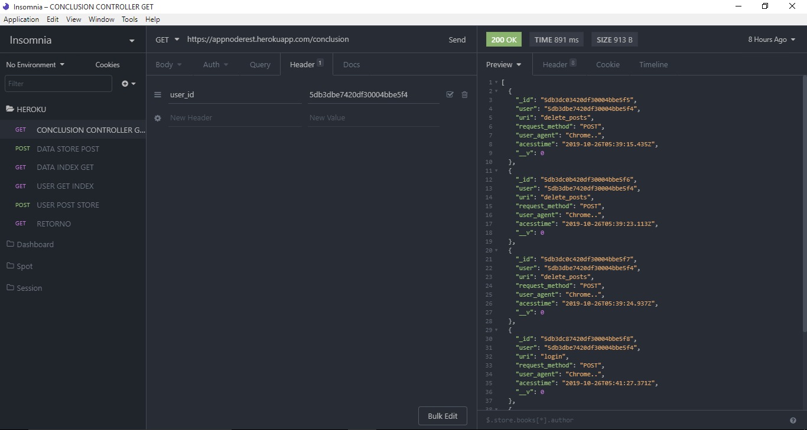

# apinoderest

Criada uma API REST disponível no Heroku.

Link para acesso à API (https://appnoderest.herokuapp.com/)

Foi utilizado NodeJS para implementação, sendo feito consumo da API pelo [Insomnia] (https://insomnia.rest/download/)

A imagem abaixo mostra um "GET" da API, onde são mostrados ID do usuário, URI (simplificada), REQUEST_METHOD, USER_AGENT E ACESS_TIME. 

